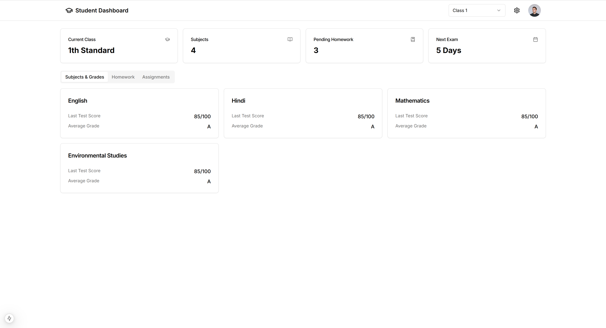

open vs code terminal and copy past this code 

Git Colne https://github.com/Programming-Communities/Student-Dashboard.git
 
 run this come 
```
npm i
```
open done
http://localhost:3000/dashboard


